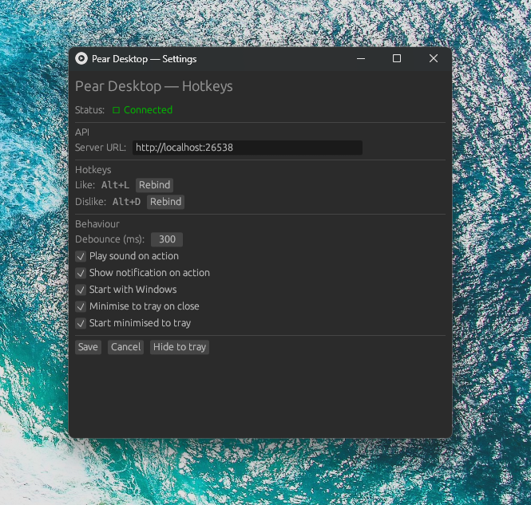

# Pear Hotkeys — Windows

[](https://github.com/CalG24/pear-hotkeys/actions/workflows/windows-rust.yml)
[](https://github.com/CalG24/pear-hotkeys/releases)
[](LICENSE)
[](https://github.com/CalG24/pear-hotkeys/releases)

A lightweight Windows tray app that adds global hotkeys for Liking / Disliking tracks via [Pear Desktop](https://github.com/pear-desktop)'s **API [Beta]** plugin.

Started as a small personal test of that plugin's API; it's since grown into a full tray application with a settings UI, rebindable hotkeys, notifications etc.



## Features

- 🎹 **Global hotkeys** for Like / Dislike, rebindable from the UI (defaults: `Alt+L` / `Alt+D`)
- 🍐 **System tray icon** that reflects the current like/dislike state at a glance
- 🖱️ **Tray menu** — Show/Hide window, Quit
- 🔔 **Desktop notifications** on each action
- 🔊 Optional **sound feedback** on action
- 🪟 **Start with Windows**, with configurable **start minimised to tray**
- ➖ **Minimise to tray on close** instead of exiting
- ⚙️ Simple settings window — server URL, hotkeys, debounce timing, all toggles

## Installation

1. Grab the latest `pear-hotkeys-win.exe` from the [Releases page](https://github.com/CalG24/pear-hotkeys/releases).
2. Make sure [Pear Desktop](https://github.com/pear-desktop) is running with the **API [Beta]** plugin enabled.
3. Run the `.exe`. It starts in the tray — right-click the icon for options, or left-click to open Settings.

## Usage

| Action | How |
|---|---|
| Like current track | Press `Alt+L` (default, rebindable) |
| Dislike current track | Press `Alt+D` (default, rebindable) |
| Open Settings | Left-click the tray icon |
| Show tray menu | Right-click the tray icon |
| Hide to tray | Close the window (if "Minimise to tray on close" is enabled) or use **Hide to tray** in Settings |
| Quit | Right-click tray icon → **Quit** |

Tray icon colour/state updates automatically to reflect whether the current track is liked, disliked, or neither.

## Configuration

All settings are editable from the Settings window and persisted automatically on **Save**:

- **Server URL** — address of the Pear Desktop API (default `http://localhost:26538`)
- **Hotkeys** — click **Rebind**, then press the new key combo
- **Debounce (ms)** — minimum time between triggers, to avoid accidental double-presses
- **Play sound on action**
- **Show notification on action**
- **Start with Windows**
- **Minimise to tray on close**
- **Start minimised to tray**

Settings are saved to a local `config.toml`.

## Building from source

Requirements:
- [Rust](https://rustup.rs/) (stable toolchain)
- Windows 10/11
- MSVC build tools (needed for `winres` to embed the app icon)

```powershell
git clone https://github.com/CalG24/pear-hotkeys.git
cd pear-hotkeys
git checkout windows
cargo build --release
```
### Linux

#### This README covers the Windows build (windows branch). The linux branch is an archive of the project's earliest history, back when it was a small dev test of the API plugin — kept as a starting reference for anyone wanting to build a Linux version.

### Contributing

#### Issues and pull requests are welcome. For larger changes, please open an issue first to discuss what you'd like to change.
